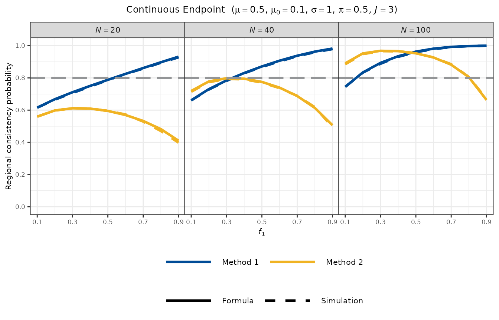
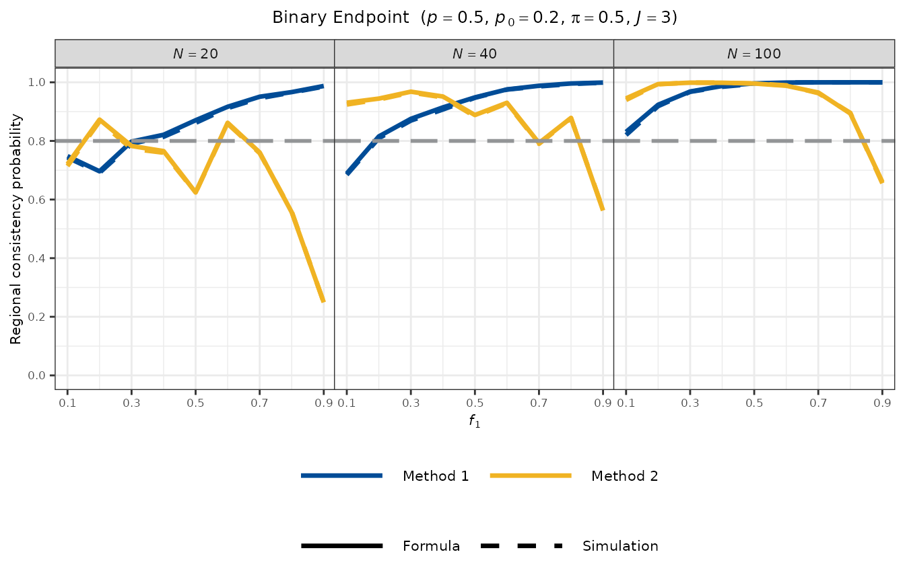
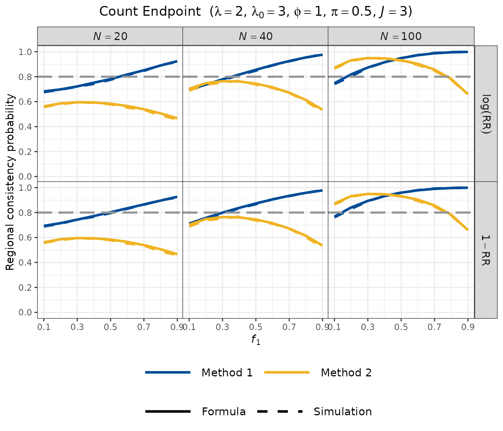

# Non-Survival Endpoints: Continuous, Binary, and Count

This vignette describes Regional Consistency Probability (RCP)
calculations for three non-survival endpoint types: **continuous**,
**binary**, and **count** (negative binomial). For each endpoint, the
statistical model, treatment effect scale, closed-form formulae, and
worked examples are provided.

------------------------------------------------------------------------

## 1. Continuous Endpoint

### Statistical model

Let ${\widehat{\mu}}_{j}$ denote the sample mean for Region $j$. Under
the assumption that individual observations are independently and
identically distributed as $N\left( \mu,\sigma^{2} \right)$ within each
region, the regional sample means are:

$${\widehat{\mu}}_{j} \sim N\!\left( \mu,\;\frac{\sigma^{2}}{N_{j}} \right),\qquad j = 1,\ldots,J$$

independently across regions. The treatment effect relative to a
historical control mean $\mu_{0}$ is $\delta = \mu - \mu_{0} > 0$.

### Consistency criteria

**Method 1 (Effect Retention):**

$$\text{RCP}_{1} = \Pr\!\left\lbrack \,\left( {\widehat{\mu}}_{1} - \mu_{0} \right) \geq \pi\,\left( \widehat{\mu} - \mu_{0} \right)\, \right\rbrack$$

Defining
$D = \left( {\widehat{\mu}}_{1} - \mu_{0} \right) - \pi\left( \widehat{\mu} - \mu_{0} \right)$,
the condition $D \geq 0$ is equivalent to:

$$D = \left( 1 - \pi f_{1} \right)\,\left( {\widehat{\mu}}_{1} - \mu_{0} \right) - \pi\left( 1 - f_{1} \right)\,\left( {\widehat{\mu}}_{- 1} - \mu_{0} \right) \geq 0$$

where ${\widehat{\mu}}_{- 1}$ is the sample mean pooled over regions
$2,\ldots,J$. Under homogeneity:

$$E\lbrack D\rbrack = (1 - \pi)\,\delta,\qquad{Var}(D) = \left( 1 - \pi f_{1} \right)^{2}\,\frac{\sigma^{2}}{N_{1}} + \lbrack\pi\left( 1 - f_{1} \right)\rbrack^{2}\,\frac{\sigma^{2}}{N - N_{1}}$$

Therefore:

$$\text{RCP}_{1} = \Phi\!\left( \frac{(1 - \pi)\,\delta}{\sqrt{\left( 1 - \pi f_{1} \right)^{2}\,\sigma^{2}/N_{1} + \{\pi\left( 1 - f_{1} \right)\}^{2}\,\sigma^{2}/\left( N - N_{1} \right)}} \right)$$

**Method 2 (Simultaneous Positivity):**

$$\text{RCP}_{2} = \Pr\!\left\lbrack \,{\widehat{\mu}}_{j} > \mu_{0}\;{\mspace{6mu}\text{for all}\mspace{6mu}}j\, \right\rbrack = \prod\limits_{j = 1}^{J}\Phi\!\left( \frac{\delta\,\sqrt{N_{j}}}{\sigma} \right)$$

### Example

Setting: $\mu = 0.5$, $\mu_{0} = 0.1$, $\sigma = 1$, $N = 100$ ($J = 3$
regions with $N_{1} = 20$), $\pi = 0.5$.

``` r
result_f <- rcp1armContinuous(
  mu       = 0.5,
  mu0      = 0.1,
  sd       = 1,
  Nj       = c(20, 40, 40),
  PI       = 0.5,
  approach = "formula"
)
print(result_f)
#> 
#> Regional Consistency Probability for Single-Arm MRCT
#> Endpoint : Continuous
#> 
#>    Approach    : Closed-Form Solution
#>    Target Mean : mu  = 0.5000
#>    Null Mean   : mu0 = 0.1000
#>    Std. Dev.   : sd  = 1.0000
#>    Sample Size : Nj  = (20, 40, 40)
#>    Total Size  : N   = 100
#>    Threshold   : PI  = 0.5000
#> 
#> Consistency Probabilities:
#>    Method 1 (Region 1 vs Overall)  : 0.8340
#>    Method 2 (All Regions > mu0)    : 0.9522
```

``` r
result_s <- rcp1armContinuous(
  mu       = 0.5,
  mu0      = 0.1,
  sd       = 1,
  Nj       = c(20, 40, 40),
  PI       = 0.5,
  approach = "simulation",
  nsim     = 10000,
  seed     = 1
)
print(result_s)
#> 
#> Regional Consistency Probability for Single-Arm MRCT
#> Endpoint : Continuous
#> 
#>    Approach    : Simulation-Based (nsim = 10000)
#>    Target Mean : mu  = 0.5000
#>    Null Mean   : mu0 = 0.1000
#>    Std. Dev.   : sd  = 1.0000
#>    Sample Size : Nj  = (20, 40, 40)
#>    Total Size  : N   = 100
#>    Threshold   : PI  = 0.5000
#> 
#> Consistency Probabilities:
#>    Method 1 (Region 1 vs Overall)  : 0.8338
#>    Method 2 (All Regions > mu0)    : 0.9479
```

### Visualisation

``` r
plot_rcp1armContinuous(
  mu        = 0.5,
  mu0       = 0.1,
  sd        = 1,
  PI        = 0.5,
  N_vec     = c(20, 40, 100),
  J         = 3,
  nsim      = 5000,
  seed      = 1,
  base_size = 8
)
```



------------------------------------------------------------------------

## 2. Binary Endpoint

### Statistical model

Let $Y_{j}$ denote the number of responders in Region $j$. Under
independent Bernoulli trials with a common response rate $p$:

$$Y_{j} \sim {Binomial}\left( N_{j},\; p \right),\qquad j = 1,\ldots,J$$

independently across regions. The regional response rate estimator is
${\widehat{p}}_{j} = Y_{j}/N_{j}$, the overall estimator is
$\widehat{p} = \sum_{j}Y_{j}/N$, and the treatment effect is
$\delta = p - p_{0} > 0$.

### Consistency criteria

**Method 1 (Effect Retention) — Exact Enumeration:**

$$\text{RCP}_{1} = \Pr\!\left\lbrack \,\left( {\widehat{p}}_{1} - p_{0} \right) \geq \pi\,\left( \widehat{p} - p_{0} \right)\, \right\rbrack$$

By the additivity of independent binomials,
$Y_{- 1} = \sum_{j \geq 2}Y_{j} \sim {Binomial}\left( N - N_{1},\; p \right)$.
The formula approach enumerates all combinations
$\left( y_{1},y_{- 1} \right) \in \{ 0,\ldots,N_{1}\} \times \{ 0,\ldots,N - N_{1}\}$
and sums the joint probabilities satisfying the consistency condition:

$$\text{RCP}_{1} = \sum\limits_{y_{1} = 0}^{N_{1}}\sum\limits_{y_{- 1} = 0}^{N - N_{1}}b\left( y_{1};\, N_{1},\, p \right)\; b\left( y_{- 1};\, N - N_{1},\, p \right) \cdot \mathbf{1}\!\left\lbrack \frac{y_{1}}{N_{1}} - p_{0} \geq \pi\!\left( \frac{y_{1} + y_{- 1}}{N} - p_{0} \right) \right\rbrack$$

where $b(y;\, n,\, p) = \left( \frac{n}{y} \right)p^{y}(1 - p)^{n - y}$.

**Method 2 (Simultaneous Positivity):**

The condition ${\widehat{p}}_{j} > p_{0}$ is equivalent to
$Y_{j} \geq y_{j,\min}$ where
$y_{j,\min} = \lfloor N_{j}p_{0}\rfloor + 1$. Denoting by
$F_{{Bin}{(n,\, p)}}(k)$ the CDF of the binomial distribution with
parameters $n$ and $p$ evaluated at $k$:

$$\text{RCP}_{2} = \prod\limits_{j = 1}^{J}\left\lbrack 1 - F_{{Bin}{(N_{j},\, p)}}\left( y_{j,\min} - 1 \right) \right\rbrack$$

### Example

Setting: $p = 0.5$, $p_{0} = 0.2$, $N = 100$ ($J = 3$ regions with
$N_{1} = 20$), $\pi = 0.5$.

``` r
result_f <- rcp1armBinary(
  p        = 0.5,
  p0       = 0.2,
  Nj       = c(20, 40, 40),
  PI       = 0.5,
  approach = "formula"
)
print(result_f)
#> 
#> Regional Consistency Probability for Single-Arm MRCT
#> Endpoint : Binary
#> 
#>    Approach      : Exact Solution
#>    Response Rate : p  = 0.5000
#>    Null Rate     : p0 = 0.2000
#>    Sample Size   : Nj = (20, 40, 40)
#>    Total Size    : N  = 100
#>    Threshold     : PI = 0.5000
#> 
#> Consistency Probabilities:
#>    Method 1 (Region 1 vs Overall) : 0.9234
#>    Method 2 (All Regions > p0)    : 0.9939
```

``` r
result_s <- rcp1armBinary(
  p        = 0.5,
  p0       = 0.2,
  Nj       = c(20, 40, 40),
  PI       = 0.5,
  approach = "simulation",
  nsim     = 10000,
  seed     = 1
)
print(result_s)
#> 
#> Regional Consistency Probability for Single-Arm MRCT
#> Endpoint : Binary
#> 
#>    Approach      : Simulation-Based (nsim = 10000)
#>    Response Rate : p  = 0.5000
#>    Null Rate     : p0 = 0.2000
#>    Sample Size   : Nj = (20, 40, 40)
#>    Total Size    : N  = 100
#>    Threshold     : PI = 0.5000
#> 
#> Consistency Probabilities:
#>    Method 1 (Region 1 vs Overall) : 0.9203
#>    Method 2 (All Regions > p0)    : 0.9933
```

### Visualisation

``` r
plot_rcp1armBinary(
  p         = 0.5,
  p0        = 0.2,
  PI        = 0.5,
  N_vec     = c(20, 40, 100),
  J         = 3,
  nsim      = 5000,
  seed      = 1,
  base_size = 8
)
```



------------------------------------------------------------------------

## 3. Count Endpoint (Negative Binomial)

### Statistical model

Count data are modelled by the negative binomial distribution. The total
event count in Region $j$ is:

$$Y_{j} \sim {NB}\!\left( \mu = N_{j}\,\lambda,\;\;{size} = N_{j}\,\phi \right),\qquad j = 1,\ldots,J$$

independently across regions, where $\lambda > 0$ is the expected count
per patient under the alternative and $\phi > 0$ is the dispersion
parameter. The regional rate estimator is
${\widehat{\lambda}}_{j} = Y_{j}/N_{j}$, and the treatment effect is
expressed as a **rate ratio**:

$${\widehat{RR}}_{j} = \frac{{\widehat{\lambda}}_{j}}{\lambda_{0}}$$

Benefit is indicated by $RR = \lambda/\lambda_{0} < 1$.

By the **reproducibility property** of the negative binomial, the pooled
count for regions $2,\ldots,J$ follows
${NB}\left( \mu = \left( N - N_{1} \right)\lambda,\;{size} = \left( N - N_{1} \right)\phi \right)$,
enabling exact enumeration analogous to the binary case.

### Consistency criteria

**Method 1 (log-RR scale):**

$$\text{RCP}_{1,\log} = \Pr\!\left\lbrack \,\log\left( {\widehat{RR}}_{1} \right) \leq \pi\,\log\left( \widehat{RR} \right)\, \right\rbrack$$

Since $RR < 1$ (benefit), $\log(RR) < 0$, so the condition requires
$\log\left( {\widehat{RR}}_{1} \right)$ to be sufficiently negative
relative to the overall $\log\left( \widehat{RR} \right)$.

**Method 1 (linear-RR scale):**

$$\text{RCP}_{1,\text{lin}} = \Pr\!\left\lbrack \,\left( 1 - {\widehat{RR}}_{1} \right) \geq \pi\,\left( 1 - \widehat{RR} \right)\, \right\rbrack$$

Both Method 1 variants use exact enumeration over all
$\left( y_{1},y_{- 1} \right)$ combinations via the outer product of
negative binomial PMFs.

**Method 2:**

Denoting by $F_{{NB}{(\mu,\,\phi)}}(k)$ the CDF of the negative binomial
distribution with mean $\mu$ and size $\phi$ evaluated at $k$, the
condition ${\widehat{RR}}_{j} < 1$ is equivalent to
$Y_{j} < N_{j}\lambda_{0}$, i.e.,
$Y_{j} \leq \lfloor N_{j}\lambda_{0}\rfloor - 1$ when $N_{j}\lambda_{0}$
is not an integer (and $Y_{j} \leq N_{j}\lambda_{0} - 1$ otherwise).
Therefore:

$$\text{RCP}_{2} = \prod\limits_{j = 1}^{J}\Pr\!\left( {\widehat{RR}}_{j} < 1 \right) = \prod\limits_{j = 1}^{J}F_{{NB}{(N_{j}\lambda,\, N_{j}\phi)}}\!\left( \lfloor N_{j}\lambda_{0}\rfloor - 1 \right)$$

### Example

Setting: $\lambda = 2$, $\lambda_{0} = 3$, $\phi = 1$, $N = 100$
($J = 3$ regions with $N_{1} = 20$), $\pi = 0.5$.

``` r
result_f <- rcp1armCount(
  lambda     = 2,
  lambda0    = 3,
  dispersion = 1,
  Nj         = c(20, 40, 40),
  PI         = 0.5,
  approach   = "formula"
)
print(result_f)
#> 
#> Regional Consistency Probability for Single-Arm MRCT
#> Endpoint : Count (Negative Binomial)
#> 
#>    Approach       : Exact Solution
#>    Expected Count : lambda     = 2.000000
#>    Control Count  : lambda0    = 3.000000
#>    Dispersion     : dispersion = 1.000000
#>    Sample Size    : Nj         = (20, 40, 40)
#>    Total Size     : N          = 100
#>    Threshold      : PI         = 0.5000
#> 
#> Consistency Probabilities:
#>    Method 1 (Region 1 vs Overall):
#>       Log-RR based    : 0.8186
#>       Linear-RR based : 0.8406
#>    Method 2 (All Regions Show Benefit):
#>       RR < 1          : 0.9320
```

``` r
result_s <- rcp1armCount(
  lambda     = 2,
  lambda0    = 3,
  dispersion = 1,
  Nj         = c(20, 40, 40),
  PI         = 0.5,
  approach   = "simulation",
  nsim       = 10000,
  seed       = 1
)
print(result_s)
#> 
#> Regional Consistency Probability for Single-Arm MRCT
#> Endpoint : Count (Negative Binomial)
#> 
#>    Approach       : Simulation-Based (nsim = 10000)
#>    Expected Count : lambda     = 2.000000
#>    Control Count  : lambda0    = 3.000000
#>    Dispersion     : dispersion = 1.000000
#>    Sample Size    : Nj         = (20, 40, 40)
#>    Total Size     : N          = 100
#>    Threshold      : PI         = 0.5000
#> 
#> Consistency Probabilities:
#>    Method 1 (Region 1 vs Overall):
#>       Log-RR based    : 0.8118
#>       Linear-RR based : 0.8331
#>    Method 2 (All Regions Show Benefit):
#>       RR < 1          : 0.9276
```

The output reports three RCP values: Method 1 on the log-RR scale
(`Method1_logRR`), Method 1 on the linear-RR scale (`Method1_linearRR`),
and Method 2 (`Method2`).

### Visualisation

The count endpoint plot uses a grid layout: facet rows distinguish the
two Method 1 scales (log-RR and $1 - RR$), and facet columns correspond
to different total sample sizes.

``` r
plot_rcp1armCount(
  lambda     = 2,
  lambda0    = 3,
  dispersion = 1,
  PI         = 0.5,
  N_vec      = c(20, 40, 100),
  J          = 3,
  nsim       = 5000,
  seed       = 1,
  base_size  = 11
)
```



------------------------------------------------------------------------

## Summary

| Endpoint   | Model             | Effect parameter                                                                                                                             | Benefit direction               | Method 1 computation                  | Method 2 computation                   |
|:-----------|:------------------|:---------------------------------------------------------------------------------------------------------------------------------------------|:--------------------------------|:--------------------------------------|:---------------------------------------|
| Continuous | Normal            | $\delta = \mu - \mu_{0}$                                                                                                                     | ${\widehat{\mu}}_{j} > \mu_{0}$ | Closed-form (normal approximation)    | Product of normal tail probabilities   |
| Binary     | Binomial          | $\delta = p - p_{0}$                                                                                                                         | ${\widehat{p}}_{j} > p_{0}$     | Exact enumeration (binomial)          | Product of binomial tail probabilities |
| Count      | Negative binomial | $\log(RR) = \log\left( \lambda/\lambda_{0} \right)$ (Method 1, log-RR scale); $1 - RR = 1 - \lambda/\lambda_{0}$ (Method 1, linear-RR scale) | ${\widehat{RR}}_{j} < 1$        | Exact enumeration (negative binomial) | Product of NB tail probabilities       |

------------------------------------------------------------------------

## References

Homma G (2024). Cautionary note on regional consistency evaluation in
multiregional clinical trials with binary outcomes. *Pharmaceutical
Statistics*, 23(3):385–398. <https://doi.org/10.1002/pst.2358>
